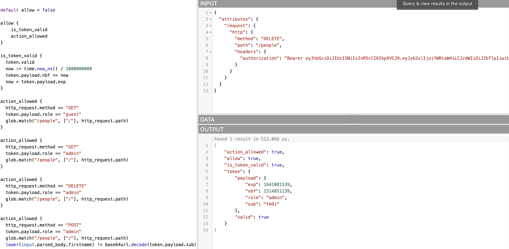
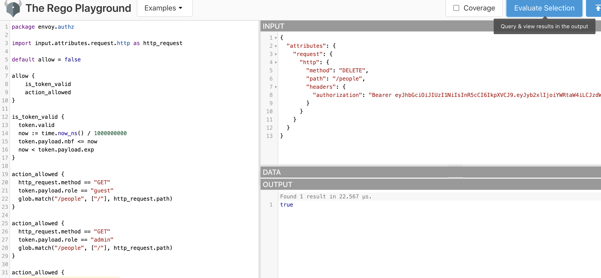

# OPA Test - TJ's test notes for OPA policy

NB: Drop down to New policy solution section for method

## Task

 Styra Technical Exercise
Microservice Authorization with OPA and Envoy
Congratulations on reaching this stage in the Styra interview process! As a next step, we invite you to complete a technical exercise. This exercise has two goals:
1. Expose you to the Open Policy Agent and how it works with Envoy, to help you judge your own interest in this role and the technologies involved, and;
2. Help the Styra team understand how you approach problems, how you present solutions, and how you engage professionally.

Exercise

The Open Policy Agent website includes a tutorial on using OPA for microservices authorization with Envoy (link below). Please work through that tutorial, keeping detailed notes about what you did, what challenges you faced, and how you tried to solve them.
* https://www.openpolicyagent.org/docs/latest/envoy-tutorial-standalone-envoy/ 

Once you have completed the tutorial, please update the policy to enforce the following:
* Allow a user role associated with the “delete” permission the ability to delete a person
Please create Rego Tests for the policy as well.
Hints:
* Review the Go code for the sample application (linked from within the tutorial) to
understand the API endpoint that can be called to delete a person
* The “policy.rego” file in the tutorial contains an icon   to open the policy in the Rego
Playground.
* You should create a data structure (i.e. a Rego Object) to define a “role to permission” mapping that assigns the “delete” permission to a role. You can use the “admin” role for the specific “delete” permission assignment, however your assignment mapping should allow for multiple (or alternate) role definitions and multiple (or alternate) permissions to be associated. Your Rego policy rule will use the data from the Rego object in the rule expressions, therefore the rule behavior will be able to be modified by updating the data in the object, rather than the rule expressions.
      
Output

As output, please write up your process, results, and any other thoughts you consider relevant. Also, please be sure to include the policy code and tests for the additional policy.

---------------------------------------------------------------------------------------------

## New policy solution

New policy section added to policy.rego
```
action_allowed {
  http_request.method == "DELETE"
  token.payload.role == "admin"
  glob.match("/people", ["/"], http_request.path)
}
```
This was run with the "admin token" as input in rego playground https://play.openpolicyagent.org/p/Om8GUFQNi7

Test 1 evaluates the policy works with the new addition


Test 2 evaluates just the new policy added


## Error
I had the following error with 2 of the pods failing as follows: 

* example-app-79cd94dbb8-skb9b   1/3     CrashLoopBackOff   14         12m

Resolution: Created fine on AKS so Problem was with Minikube. Delete all resources and recreated them. This solved the issue


## Notes
###  Command list to prove the containers built properly
```

kubectl get pods
kubectl describe pod 
kubectl get deployment
kubectl delete deployment ..........
kubectl get deployment -A
kubectl get events
kubectl get nodes
kubectl cluster-info dump
kubectl get cm
kubectl get cm proxy-config
kubectl get cm proxy-config -oyaml
kubectl get cm -A
k9s -c pod
```


Setup

* Docker installation
https://docs.docker.com/docker-for-mac/install/
* Install OPA https://github.com/MLstate/opalang/wiki/Building-Opa
```
curl -L -o opa \
https://openpolicyagent.org/downloads/latest/opa_darwin_amd64; \
chmod 755 ./opa
```
* Run OPA Playground policy
```
./opa run --server \
--log-format text \
--set decision_logs.console=true \
--set bundles.play.polling.min_delay_seconds=5 \
--set bundles.play.polling.max_delay_seconds=10 \
--set services.play.url=https://play.openpolicyagent.org \
--set bundles.play.resource=bundles/9WnO8Siyaw
```


* brew install k9s
* brew install yamllint
* brew install kube-score/tap/kube-score
* kube-score score deployment.yaml

Links

* https://www.openpolicyagent.org/docs/latest/envoy-tutorial-standalone-envoy/

* https://play.openpolicyagent.org/p/inCdnw6Dat

